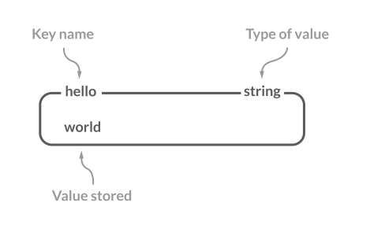

# Redis

Redis(**Re**mote **di**ctionary **s**erver)，即 远程字典服务，是一个基于C语言开发的内存型-可持久化-键值对-NoSQL(Not only SQL)-数据库

Redis广泛用于实际生产环境，读写速度非常快，适用于分布式缓存集群

## Redis快在何处


上图从三个方面总结了Redis性能突出的原因:

- **RAM-based**: 基于内存，访存的速度远高于磁盘IO的速度(120$ns$ PK 50$\mu s$)

- **IO多路复用+单线程事件循环**: 基于Reactor模式设计了一套高效的事件处理模型，单线程读写事件循环配合IO多路复用

- **高效数据结构**: Redis内置的5大基础类型其底层采用的都是优化过后的数据结构，性能较高

## 为什么要采用Redis/为什么项目要使用缓存

### 高性能

数据库的表是保存在硬盘中的，而磁盘IO速度相比访存速度而言弗如远甚，项目里总会存在一些常用的热点数据，如果用户每次发起请求都需要从数据库中读出这些数据难免对性能有所损失。

如果这些热点数据不会经常改变，就可以考虑将它们放在缓存里(比如Redis这种缓存数据库)，用户下一次访问这些热点数据时，可以直接从存放在内存中的缓存里取出，节省了MySQL消耗的数据库连接资源

### 高并发

假设CPU为相对性能较高的4核8G处理器，对于MySQL这样的传统关系型数据库而言，其QPS(Query Per Second)大概在$10^4$左右，但是使用Redis缓存时QPS可以达到$10^5 \sim 3 \times 10^5$，比前者高1个数量级

访存能够承受的内存数据库请求数量远高于直接访问关系型数据库请求数量，将数据库的部分数据备份到缓存中，这样用户的部分请求会落在访问缓存这一环节上，进而提高系统整体的并发性

## 缓存读写策略

缓存与数据库具有多种组合方式，根据缓存读写策略的不同，可以大致分为3种: 旁路缓存模式、读写穿透模式、异步写入模式

### Cache Aside Pattern 旁路缓存

旁路缓存模式是应用场景很多的一种缓存读写模式，比较适合**读请求较多**的场景

旁路缓存模式下服务端负责同时维护db和cache，且数据以db中存储的为基准

#### Cache Aside Write


写策略:

- 先更新db

- 再直接删除cache

FAQ:

1. Q:可以先删除cache再更新db吗？ A: 可能会导致数据不一致的问题，比如请求1先写数据A，如果先删除A数据的cache，此时再有个请求2要读数据A只能去db中读取，但是db中的数据还没更新，造成请求2读取的数据不一致

2. Q:可是先更新db再删除cache也存在时间差，不是也会导致数据不一致吗? A: 数据库写入速度较慢而缓存写入速度快很多，虽然也会出现数据不一致问题但是总体概率很小

#### Cache Aside Read


读策略:

- 从cache中读取请求的数据，有则直接返回

- cache中没有对应数据，从db中读取数据并返回

- 服务端在响应请求的同时，将该数据放到cache里

#### 缺点与解决办法

旁路缓存说白了就是 cache一旦未击中，就去db中取数据，再将该数据放到cache中

缺陷：

1. 首次请求数据一定不在cache中

   **解决方法**：将常用的热点数据提前放入cache里

2. 写操作较为频繁时会导致cache中的数据被频繁删除，影响缓存命中率，这也是旁路缓存适用于读请求较多场景的原因

   **解决方法**：

   - 数据库与缓存需要数据强一致性场景: 更新db后不等下一个请求同时更新cache，需要使用锁(集群采用分布式锁)保证更新cache时不会出现线程安全问题

   - 数据库与缓存可以短暂不一致的场景: 更新db时立马更新cache

### Write/Read Through Pattern 读写穿透

读写穿透模式下，服务端将cache作为主要数据存储，从cache中读写数据，而cache**负责**将更新数据写入数据库里

这样服务端在写数据时只要命中了cache就不需要自己直接操作数据库，减轻了服务端的压力，但是对于缓存服务器的性能要求较高，因为它除了要负责处理读写缓存的请求，还要消耗资源读写数据库

除了性能原因外，大部分项目也不会采取这种模式，因为技术选型时如果使用了分布式Redis集群作为缓存，而Redis没有提供与数据库互操作的功能，还需要再起一个服务模块负责沟通两者导致舍本逐末

#### Write Through


写穿策略:

- 先查cache，cache未命中则**服务端负责**更新db
  
- cache命中，先更新cache，然后**cache负责**同步更新db

#### Read Through


读穿策略:

- 先查cache，cache命中后直接返回数据

- cache未命中，**cache负责**读取db中数据，写入cache后再返回

读写穿透模式其实是对旁路缓存模式的进一步封装，将**读数据时cache未命中**情况下的db写操作交给cache自己处理，对客户端是透明的，也比较适合读请求较多的场景

### Write Begind Pattern 异步写入

异步写入模式与读写穿透模式类似，只是更新数据时**不会同步更新**db和cache，异步写入模式优先更新cache，将对应的db更新操作积攒到一定程度后采用异步批量方式更新

异步写入模式的数据一致性更难保障，比如cache已经更新数据了，但是db更新还没开始cache服务就宕机导致后续异步更新操作不翼而飞

这种缓存读写策略的应用场景主要有: 消息队列将消息异步写入磁盘、MySQL的Innodb Buffer Pool机制等

适合**写请求较多**即数据经常变化而一致性要求没有很高的场景，比如资源浏览量、点赞量等数据统计型场景

## Redis 5种基础数据结构

Redis官网详细介绍了[Redis数据结构](https://redis.com/redis-enterprise/data-structures/)，提供了5种直接供用户使用的数据结构: String(字符串)、List(列表)、Set(集合)、Hash(散列)、Zset(有序集合)

其底层实现利用了Redis自己实现的存储数据结构：SDS(简单动态字符串)、LinkedList(双向列表)、Hash Table(哈希表)、SkipList(跳表)、Intset(整数集合)、ZipList(压缩列表)、QuickList(快速列表)

| Data Structure | Base Storage Data Structure |
| -- | -- |
| String | SDS |
| List | LinkedList / ZipList / QuickList |
| Set | Hash Table / ZipList |
| Hash | ZipList / Intset |
| Zset | ZipList / SkipList |

### String 字符串



String是Redis最简单也最常用的数据结构，可以存储任何以字符串类型存在的数据，比如字符串、整数、浮点数、图片的base64编码串、**序列化后的对象**等

String底层采用SDS实现，而不是C语言的原生字符串(以空字符`\0`结尾的char数组)，[Redis7.0-SDS类型声明](https://github.com/redis/redis/blob/7.0/src/sds.h)如下:

```c
/* Note: sdshdr5 is never used, we just access the flags byte directly.
 * However is here to document the layout of type 5 SDS strings. */
struct __attribute__ ((__packed__)) sdshdr5 {
    unsigned char flags; /* 3 lsb of type, and 5 msb of string length */
    char buf[];
};
struct __attribute__ ((__packed__)) sdshdr8 {
    uint8_t len; /* used */
    uint8_t alloc; /* excluding the header and null terminator */
    unsigned char flags; /* 3 lsb of type, 5 unused bits */
    char buf[];
};
struct __attribute__ ((__packed__)) sdshdr16 {
    uint16_t len; /* used */
    uint16_t alloc; /* excluding the header and null terminator */
    unsigned char flags; /* 3 lsb of type, 5 unused bits */
    char buf[];
};
struct __attribute__ ((__packed__)) sdshdr32 {
    uint32_t len; /* used */
    uint32_t alloc; /* excluding the header and null terminator */
    unsigned char flags; /* 3 lsb of type, 5 unused bits */
    char buf[];
};
struct __attribute__ ((__packed__)) sdshdr64 {
    uint64_t len; /* used */
    uint64_t alloc; /* excluding the header and null terminator */
    unsigned char flags; /* 3 lsb of type, 5 unused bits */
    char buf[];
};
```

SDS共有5种实现方式，除了第一种`sdshdr5`实际并不包含长度信息，后四种`sdshdr8`、`sdshdr16`、`sdshdr32`、`sdshdr64`对应`uint8_t`~`uint64_t`的实际长度信息。Redis会根据初始化的长度决定具体使用类型，减少内存占用

字段属性释义:

- `len`: 字符串长度(已经使用的字节数)
- `alloc`: 字符空间总大小，`alloc` - `len`即可计算SDS剩余可分配空间的大小
- `buf[]`: 实际存储字符串的字符数组
- `flags`: 单字节标记位，目前只用到了低3位，高5位暂时保留未使用(以后可以扩展)

SDS相比C的原生字符串有以下优点:

1. 避免缓冲区溢出: 原生字符串一旦没有被分配足够的内存空间，修改时会导致缓冲区溢出，而SDS可以根据`len`和`alloc`属性检查可用空间，不满足则可扩展大小再进行操作

2. 获取字符串长度很快: 原生字符串如果不记录长度字段的情况下需要遍历计数的$O(N)$时间，而SDS直接读取`len`即可，消耗$O(1)$

3. 二进制安全: 原生字符串的定界符为`\0`，部分二进制文件(比如音视频)可能包含了定界符`\0`，导致原生字符串无法正确保存此类数据，而SDS直接使用`len`属性判断是否结束，`buf[]`数组直接存储字节形式的二进制数

常用命令如下

```sh
> SET key value # 添加键值对
OK
> GET key # 获取指定键的值
"value"
> EXISTS key # 判断是否存在指定键
(integer) 1
> SETNX key valie # 指定键不存在时才可设置键值
(integer) 0
> STRLEN key # 计算指定键存储的字符串类型值的长度
(integer) 5
> DEL key # 删除指定键(通用命令)
(integer) 1
> GET key
(nil)
> MSET k1 v1 k2 v2 # 批量添加键值对
OK
> MGET k1 k2 # 批量获取
1) "v1"
2) "v2"
> INCR k1 # 指定键存储的数字类型值+1
(error) ERR value is not an integer or out of range
> SET k1 2
OK
> DECR k1 # 指定键存储的数字类型值-1
(integer) 1
> EXPIRE k2 60 # 设置过期时间(通用命令)，否则永不过期
(integer) 1
```

### List 列表


Redis中的List为双向链表，两端都可以进行操作

常用命令如下:

```sh
> RPUSH list e1 # 列表尾部(右端)入队
(integer) 1
> LPUSH list e2 # 列表头部(左端)入队
(integer) 2
> LSET list 1 e3 # 更改指定列表指定索引的值
OK
> LRANGE list 0 1 # 获取列表索引[start, end]之间的元素 
1) "e2"
2) "e3"
> LLEN list # 获取列表里的元素个数
(integer) 2
> LPOP list # 左端出队并返回
"e2"
> RPOP list # 右端出队并返回
"e3"
```

### Hash 散列


Redis中的Hash为一个String类型的键值对映射表，内部与*JDK7*的`HashMap`类似采取数组+链表的形式构建哈希表(拉链法处理冲突)，适用于存储对象并直接修改对象的某些字段属性

常用命令如下:

```sh
> HSET hash id 123456 # 设置指定字段值
(integer) 1
> HSETNX hash id 000001 # 指定字段不存在时才能设置其值
(integer) 0
> HMSET hash name clw gender male age 24 # 批量设置
OK
> HGET hash age # 获取指定字段值
"24"
> HGETALL hash # 获取所有键值对
1) "id"
2) "123456"
3) "name"
4) "clw"
5) "gender"
6) "male"
7) "age"
8) "24"
> HEXISTS hash gpa # 判断是否存在字段
(integer) 0
> HDEL hash gender age # 批量删除字段
(integer) 2
> HLEN hash # 计算字段总数
(integer) 2
> HINCRBY hash id -1 # 对指定的数字类型字段进行简单加减运算
(integer) 123455
```

### Set 集合


Redis的Set是无须集合，元素没有先后顺序但保证唯一，类似Java的`HashSet`，适用于存储无重复数据的列表，并可通过哈希算法直接判断某个元素是否在Set内部，还提供了数学意义上集合的常用操作比如交并差等

常用命令如下:

```sh
> SADD set v1 v2 # 向指定集合添加多个元素
(integer) 2
> SMEMBERS set # 返回集合中所有元素
1) "v2"
2) "v1"
> SCARD set # 计算集合中的元素个数
(integer) 2
> SISMEMBER set v3 # 判断集合中是否存在某些元素
(integer) 0
> SADD set2 v2 v3
(integer) 2
> SINTER set set2 # 计算集合的交集
1) "v2"
> SINTERSTORE set3 set set2 # 计算交集并存储到第一个参数指定的集合中
(integer) 1
> SUNION set set2 # 计算集合的并集
1) "v2"
2) "v3"
3) "v1"
> SUNIONSTORE set4 set set2 # 计算并集并存储到第一个参数指定的集合中
(integer) 3
> SDIFF set set2 # 计算集合的差集，即所有在第一个集合中而不在后续其他集合中的元素
1) "v1"
> SPOP set4 2 # 随机移除并获取指定个数的元素
1) "v3"
2) "v2"
> SRANDMEMBER set2 1 # 随机获取指定个数的元素(不移除)
1) "v3"
```

### Zset 有序集合


Sorted Set即Zset，在Set的基础上增加了一个权重参数`score`，使得集合中元素将按照`score`即你想那个排列，并可根据`score`范围获取元素列表

常用命令如下:

```sh
> ZADD zset 1.0 v1 2.0 v2 # 添加多个元素，每个元素前给定其score
(integer) 2
> ZCARD zset # 获取指定有序集合的元素总数
(integer) 2
> ZSCORE zset v2 # 获取指定元素的score值
"2"
> ZRANGE zset 0 1 # 获取指定有序集合里索引范围内的值，score升序排列
1) "v1"
2) "v2"
> ZREVRANGE zset 0 1 # 获取指定有序集合里索引范围内的值，score降序排列 
1) "v2"
2) "v1"
> ZREVRANK zset v2 # 获取指定有序集合里指定元素的排名，score降序排列
(integer) 0
> ZREVRANK zset v1
(integer) 1
> ZRANGE zset 0 1 WITHSCORES # 使用WITHSCORES关键字同时返回元素的score值
1) "v1"
2) "1"
3) "v2"
4) "2"
> ZADD zset2 3 v2 3 v3 4 v4
(integer) 2
> ZDIFF 2 zset zset2 # 求差集
1) "v1"
> ZRANGE zset2 0 2 WITHSCORES
1) "v2"
2) "3"
3) "v3"
4) "3"
5) "v4"
6) "4"
> ZREM zset2 v4 # 移除元素
(integer) 1
> ZUNIONSTORE zset_union_res 2 zset zset2 # 求并集，注意还会合并相同元素的score值
(integer) 3
> ZRANGE zset_union_res 0 2 WITHSCORES
1) "v1"
2) "1"
3) "v3"
4) "3"
5) "v2"
6) "5"
```

## Redis线程模型

## Redis内存管理

## Redis持久化机制

Redis作为内存型数据库的一种，它与Memcached最重要的一点区别就在于Redis支持持久化，通过将内存中的数据写入到硬盘，可以支持数据重用和数据备份。Redis支持两种不同的持久化操作，一种是快照，另一种是只追加文件

### RDB持久化

RDB 即 RedisDB，通过创建快照(Snapshot)获取内存中的数据在某个时间点的副本`.rdb`二进制文件，快照可以复制到其他服务器上进而创建具有相同数据的服务器副本(比如Redis主从结构的从节点)，还可以在重启Redis服务器时自动读取快照恢复数据

RDB持久化方式是Redis**默认**采用的方式，在`redis.conf`中有以下默认配置

```sh
save 900 1          # 900秒内，如果至少有1个key发生变化，Redis就会触发bgsave命令创建快照

save 300 10         # 300秒内，如果至少有10个key发生变化，Redis就会触发bgsave命令创建快照

save 60 10000       # 60秒内，如果至少有10000个key发生变化，Redis就会触发bgsave命令创建快照
```

Redis提供了两个命令生成`.rdb`快照文件:

- `save`: 同步保存操作，会阻塞Redis主进程

- `bgsave`: 异步保存操作(background save)，fork出一个子进程，子进程保存快照，不会阻塞Redis主进程，**默认选项**

### AOF持久化

AOF 即 **A**ppend-**O**nly **F**ile，只追加文件，与快照持久化方式相比AOF持久化的实时性更好

Redis默认情况下没有开启AOF持久化，可以在`redis.conf`中设置`appendonly`参数

```sh
appendonly yes
```

开启AOF持久化后，Redis每执行一条更改数据的命令，就会将该命令写入到内存缓存`server.aof_buf`中，然后再根据配置文件中的`appendfsync`参数来决定何时写入到硬盘里的AOF文件(其保存位置与`.rdb`文件相同，默认文件名`appendonly.aof`)

```sh
appendfsync always    # 每次有数据修改发生后都会fsync到硬盘中, 会造成Redis性能的严重损失
appendfsync everysec  # 每秒钟同步一次，显式地同步到硬盘
appendfsync no        # 让操作系统决定何时进行同步
```

推荐使用`appendfsync everysec`选项，让Redis每秒同步一次AOF文件，即使服务器宕机导致内存缓存`server.aof_buf`丢失，Redis也只会丢失1秒之内的数据更新
